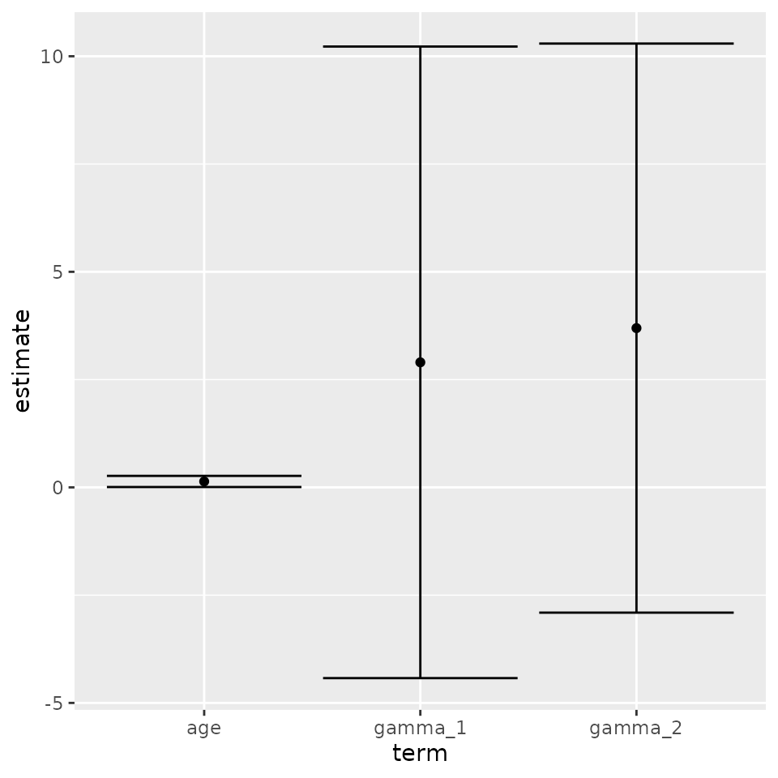
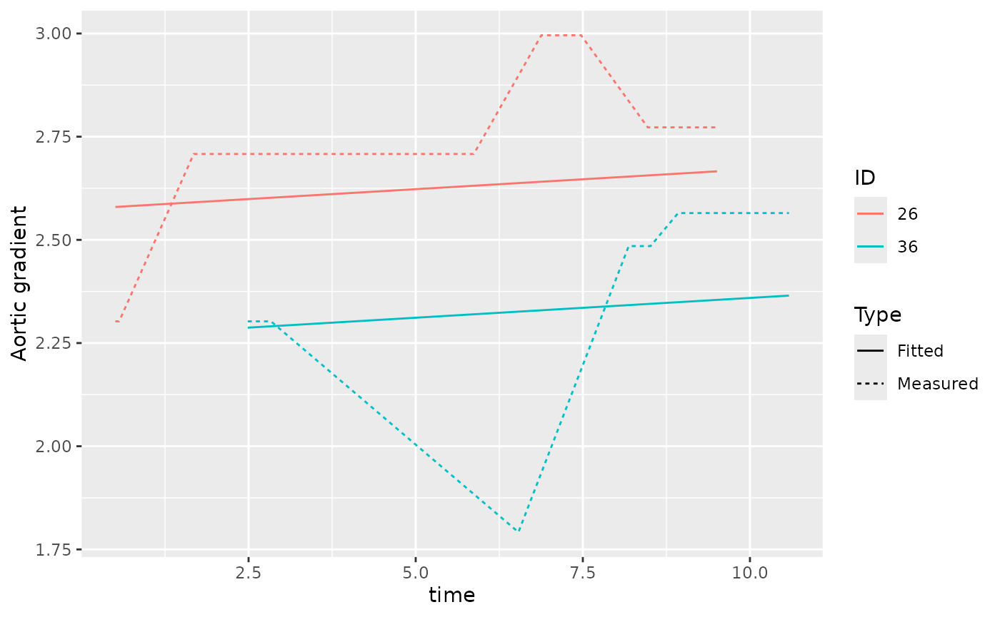

# joineRML and the broom package

## Introduction

Tidiers for objects of class `mjoint` have been included in latest
release of `joineRML` package (0.4.5).

The purpose of these tidiers are described in the introductory vignette
to `broom`:

> The broom package takes the messy output of built-in functions in R,
> such as `lm`, `nls`, or `t.test`, and turns them into tidy data
> frames.

There are three distinct tidiers included with `broom`:

- `tidy`: constructs a data frame that summarises the model estimates;

- `augment`: add columns to the original data that was modeled;

- `glance`: construct a concise one-row summary of the model.

These methods are specifically useful when plotting results of a joint
model or when comparing several models (e.g. in terms of fit).

## Example

We use the sample example from the introductory vignette to `joineRML`
using the heart valve data.

``` r

vignette("joineRML", package = "joineRML")
help("heart.valve", package = "joineRML")
```

We analyse only the records with case-complete data for heart valve
gradient (`grad`) and left ventricular mass index (`lvmi`):

``` r

data(heart.valve)
hvd <- heart.valve[!is.na(heart.valve$grad) & !is.na(heart.valve$lvmi), ]
```

Further to that, we only select the first 50 individuals to speed up
these examples:

``` r

hvd <- hvd[hvd$num <= 50, ]
```

``` r

set.seed(12345)
fit <- mjoint(
  formLongFixed = list(
    "grad" = log.grad ~ time + sex + hs,
    "lvmi" = log.lvmi ~ time + sex
  ),
  formLongRandom = list(
    "grad" = ~ 1 | num,
    "lvmi" = ~ time | num
  ),
  formSurv = Surv(fuyrs, status) ~ age,
  data = list(hvd, hvd),
  timeVar = "time"
)
```

    ## Running multivariate LMM EM algorithm to establish initial parameters...

    ## Finished multivariate LMM EM algorithm...

    ## EM algorithm has converged!

    ## Calculating post model fit statistics...

### `tidy` method

The `tidy` method returns a tidy dataset with model estimates.

``` r

tidy(fit)
```

    ## # A tibble: 3 × 5
    ##   term    estimate std.error statistic p.value
    ##   <chr>      <dbl>     <dbl>     <dbl>   <dbl>
    ## 1 age        0.137    0.0661     2.07   0.0382
    ## 2 gamma_1    2.90     3.74       0.776  0.438 
    ## 3 gamma_2    3.69     3.37       1.10   0.273

By default the `tidy` method returns the estimated coefficients for the
survival component of the joint model; however, it is possible to
extract each component by setting the `component` argument:

``` r

tidy(fit, component = "longitudinal")
```

    ## # A tibble: 7 × 5
    ##   term                estimate std.error statistic  p.value
    ##   <chr>                  <dbl>     <dbl>     <dbl>    <dbl>
    ## 1 (Intercept)_1        2.52       0.163     15.4   1.07e-53
    ## 2 time_1               0.00959    0.0310     0.309 7.57e- 1
    ## 3 sex_1                0.0336     0.230      0.146 8.84e- 1
    ## 4 hsStentless valve_1  0.0823     0.198      0.416 6.77e- 1
    ## 5 (Intercept)_2        4.99       0.0829    60.2   0       
    ## 6 time_2               0.0260     0.0129     2.02  4.36e- 2
    ## 7 sex_2               -0.197      0.209     -0.941 3.47e- 1

It is also possible to require confidence intervals to be calculated by
setting `conf.int = TRUE`, and modify the confidence level by setting
the `conf.level` argument:

``` r

tidy(fit, ci = TRUE)
```

    ## # A tibble: 3 × 5
    ##   term    estimate std.error statistic p.value
    ##   <chr>      <dbl>     <dbl>     <dbl>   <dbl>
    ## 1 age        0.137    0.0661     2.07   0.0382
    ## 2 gamma_1    2.90     3.74       0.776  0.438 
    ## 3 gamma_2    3.69     3.37       1.10   0.273

``` r

tidy(fit, ci = TRUE, conf.level = 0.99)
```

    ## # A tibble: 3 × 5
    ##   term    estimate std.error statistic p.value
    ##   <chr>      <dbl>     <dbl>     <dbl>   <dbl>
    ## 1 age        0.137    0.0661     2.07   0.0382
    ## 2 gamma_1    2.90     3.74       0.776  0.438 
    ## 3 gamma_2    3.69     3.37       1.10   0.273

The standard errors reported by default are based on the empirical
information matrix, as in `mjoint`. It is of course possible to use
bootstrapped standard errors as follows:

``` r

bSE <- bootSE(fit, 
              nboot = 100, 
              safe.boot = TRUE, 
              progress = FALSE,
              ncores = 1L)
tidy(fit, boot_se = bSE, conf.int = TRUE)
```

The results of this example are not included as it would take too long
to run for CRAN.

The `tidy` method is useful for custom plotting (e.g. forest plots) of
results from `joineRML` models, all in a tidy framework:

``` r

library(ggplot2)
out <- tidy(fit, conf.int = TRUE)
ggplot(out, aes(x = term, y = estimate, ymin = conf.low, ymax = conf.high)) +
  geom_point() +
  geom_errorbar()
```



### `augment` method

The `augment` method returns a dataset with added predictions from the
joint model. In particular, population-level and individual-level fitted
values and residuals are added to the data frame returned by the method:

``` r

preds <- augment(fit)
head(preds[, c("num", "log.grad", ".fitted_grad_0", ".fitted_grad_1", ".resid_grad_0", ".resid_grad_1")])
```

    ## # A tibble: 6 × 6
    ##   num   log.grad .fitted_grad_0 .fitted_grad_1 .resid_grad_0 .resid_grad_1
    ##   <fct>    <dbl>          <dbl>          <dbl>         <dbl>         <dbl>
    ## 1 1         2.30           2.60           2.42       -0.301        -0.114 
    ## 2 1         2.30           2.64           2.45       -0.337        -0.149 
    ## 3 1         2.30           2.65           2.46       -0.346        -0.158 
    ## 4 2         2.64           2.58           2.45        0.0563        0.188 
    ## 5 2         2.20           2.59           2.46       -0.394        -0.263 
    ## 6 2         2.48           2.60           2.47       -0.116         0.0152

``` r

head(preds[, c("num", "log.lvmi", ".fitted_lvmi_0", ".fitted_lvmi_1", ".resid_lvmi_0", ".resid_lvmi_1")])
```

    ## # A tibble: 6 × 6
    ##   num   log.lvmi .fitted_lvmi_0 .fitted_lvmi_1 .resid_lvmi_0 .resid_lvmi_1
    ##   <fct>    <dbl>          <dbl>          <dbl>         <dbl>         <dbl>
    ## 1 1         4.78           4.99           4.75        -0.213        0.0298
    ## 2 1         4.78           5.09           4.87        -0.308       -0.0869
    ## 3 1         4.92           5.11           4.90        -0.189        0.0265
    ## 4 2         4.74           5.16           4.83        -0.413       -0.0827
    ## 5 2         4.70           5.18           4.86        -0.483       -0.157 
    ## 6 2         5.06           5.21           4.89        -0.149        0.174

We can plot the resulting predictions for four distinct individuals:

``` r

out <- preds[preds$num %in% c(26, 36, 227, 244), ]
ggplot(out, aes(x = time, colour = num)) +
  geom_line(aes(y = log.grad, linetype = "Measured")) +
  geom_line(aes(y = .fitted_grad_1, linetype = "Fitted")) +
  labs(linetype = "Type", colour = "ID", y = "Aortic gradient")
```



### `glance` method

The `glance` method allows extracting summary statistics from the joint
model:

``` r

glance(fit)
```

    ## # A tibble: 1 × 5
    ##   sigma2_1 sigma2_2   AIC   BIC logLik
    ##      <dbl>    <dbl> <dbl> <dbl>  <dbl>
    ## 1    0.517    0.158  342.  374.  -153.

This allows comparing competing models easily. Say for instance that we
fit a second model with only random intercepts:

``` r

set.seed(67890)
fit2 <- mjoint(
  formLongFixed = list(
    "grad" = log.grad ~ time + sex + hs,
    "lvmi" = log.lvmi ~ time + sex
  ),
  formLongRandom = list(
    "grad" = ~ 1 | num,
    "lvmi" = ~ 1 | num
  ),
  formSurv = Surv(fuyrs, status) ~ age,
  data = list(hvd, hvd),
  timeVar = "time"
)
```

    ## Running multivariate LMM EM algorithm to establish initial parameters...

    ## Finished multivariate LMM EM algorithm...

    ## EM algorithm has converged!

    ## Calculating post model fit statistics...

We can go ahead and compare the models in terms of AIC and BIC:

``` r

glance(fit)
```

    ## # A tibble: 1 × 5
    ##   sigma2_1 sigma2_2   AIC   BIC logLik
    ##      <dbl>    <dbl> <dbl> <dbl>  <dbl>
    ## 1    0.517    0.158  342.  374.  -153.

``` r

glance(fit2)
```

    ## # A tibble: 1 × 5
    ##   sigma2_1 sigma2_2   AIC   BIC logLik
    ##      <dbl>    <dbl> <dbl> <dbl>  <dbl>
    ## 1    0.516    0.173  342.  369.  -156.

### Additional examples

Several examples of how to use `broom` including more details are
available on its introductory vignette:

``` r

vignette(topic = "broom", package = "broom")
```
