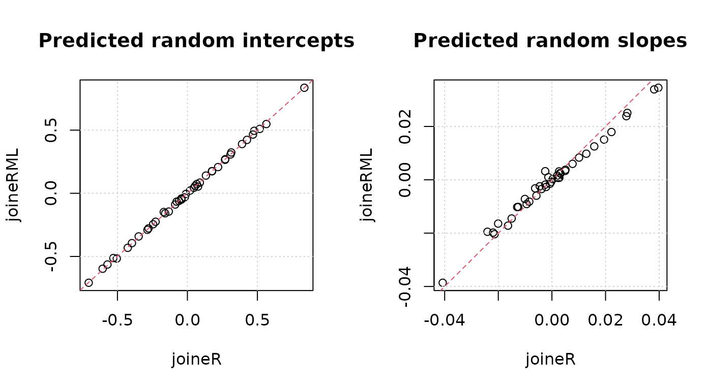

# joineRML

## Introduction

The `joineRML` package implements methods for analyzing data from
*multiple* longitudinal studies in which the responses from each subject
consists of time-sequences of repeated measurements and a possibly
censored time-to-event outcome. The modelling framework for the repeated
measurements is the multivariate linear mixed effects model. The model
for the time-to-event outcome is a Cox proportional hazards model with
log-Gaussian frailty. Stochastic dependence is captured by allowing the
Gaussian random effects of the linear model to be correlated with the
frailty term of the Cox proportional hazards model. For full details of
the model, please consult the technical vignette by running

``` r

vignette("technical", package = "joineRML")
```

## Heart valve data

### Data

The simplest way to explain the concepts of the package is through an
example. `joineRML` comes with the data set `heart.valve`. Details of
this data can be found in the help file by running the command

``` r

help("heart.valve", package = "joineRML")
```

This data is in so-called *long* or *unbalanced* format:

``` r

library("joineRML")
data("heart.valve")
head(heart.valve)
#>   num sex      age      time    fuyrs status grad log.grad   lvmi log.lvmi ef
#> 1   1   0 75.06027 0.0109589 4.956164      0   10 2.302585 118.98 4.778955 93
#> 2   1   0 75.06027 3.6794520 4.956164      0   10 2.302585 118.98 4.778955 93
#> 3   1   0 75.06027 4.6958900 4.956164      0   10 2.302585 137.63 4.924569 93
#> 4   2   0 45.79452 6.3643840 9.663014      0   14 2.639057 114.93 4.744323 68
#> 5   2   0 45.79452 7.3041100 9.663014      0    9 2.197225 109.80 4.698661 70
#> 6   2   0 45.79452 8.3013700 9.663014      0   12 2.484907 157.40 5.058790 56
#>    bsa lvh prenyha redo size con.cabg creat dm acei lv emergenc hc sten.reg.mix
#> 1 1.77   1       3    0   27        1   103  0    1  1        0  0            1
#> 2 1.77   1       3    0   27        1   103  0    1  1        0  0            1
#> 3 1.77   1       3    0   27        1   103  0    1  1        0  0            1
#> 4 1.92   1       1    1   22        0    76  0    0  2        0  0            1
#> 5 1.92   1       1    1   22        0    76  0    0  2        0  0            1
#> 6 1.92   1       1    1   22        0    76  0    0  2        0  0            1
#>                hs
#> 1 Stentless valve
#> 2 Stentless valve
#> 3 Stentless valve
#> 4       Homograft
#> 5       Homograft
#> 6       Homograft
```

The data refer to 256 patients and are stored in the unbalanced format,
which is convenient here because measurement times were unique to each
subject. The data are stored as a single R object, `heart.valve`, which
is a data frame of dimension 988 by 25. The average number of repeated
measurements per subject is therefore 988/256 = 3.86. As with any
unbalanced data set, values of time-constant variables are repeated over
all rows that refer to the same subject. The dimensionality of the data
set can be confirmed by a call to the
[`dim()`](https://rdrr.io/r/base/dim.html) function, whilst the names of
the 25 variables can be listed by a call to the
[`names()`](https://rdrr.io/r/base/names.html) function:

``` r

dim(heart.valve)
#> [1] 988  25
names(heart.valve)
#>  [1] "num"          "sex"          "age"          "time"         "fuyrs"       
#>  [6] "status"       "grad"         "log.grad"     "lvmi"         "log.lvmi"    
#> [11] "ef"           "bsa"          "lvh"          "prenyha"      "redo"        
#> [16] "size"         "con.cabg"     "creat"        "dm"           "acei"        
#> [21] "lv"           "emergenc"     "hc"           "sten.reg.mix" "hs"
```

We will only analyse a subset of this data, namely records with
case-complete data for heart valve gradient (`grad`) and left
ventricular mass index (`lvmi`):

``` r

hvd <- heart.valve[!is.na(heart.valve$grad) & !is.na(heart.valve$lvmi), ]
```

Strictly speaking, this is not necessary because `joineRML` can handle
the situation of different measurement schedules *within* subjects That
is, a subject does not need to have all multiple longitudinal outcomes
recorded at each visit. It is conceivable that some biomarkers will be
measured more or less frequently than others. For example, invasive
measurements may only be recorded annually, whereas a simple biomarker
measurement might be recorded more frequently. `joineRML` can handle
this situation by specifying each longitudinal outcome its own data
frame.

Further to that, we only select the first 50 individuals to speed up
these examples:

``` r

hvd <- hvd[hvd$num <= 50, ]
```

### Model fitting

The main function in the `joineRML` package is the
[`mjoint()`](https://graemeleehickey.github.io/joineRML/reference/mjoint.md)
function. Its main (required) arguments are:

- `formLongFixed`: a list (of length equal to the number of longitudinal
  outcome types considered) of two-sided formulae specifying the
  response on the left-hand side and the mean linear predictor terms for
  the fixed effects in the linear mixed models on the right-hand side.

- `formLongRandom`: a list (of same length as `formLongFixed`) of
  one-sided formulae specifying the model for random effects in the
  linear mixed models.

- `formSurv`: a formula specifying the proportional hazards regression
  model for the time-to-event outcome in the same structure as for
  [`survival::coxph`](https://rdrr.io/pkg/survival/man/coxph.html).

- `data`: a list (of same length as `formLongFixed`) of data.frames; one
  for each longitudinal outcome. It is assumed that the event time data
  is in the first data.frame (i.e. `data[[1]]`), unless the argument
  `survData` (which defaults to `NULL`) is specified. If $`K>1`$ and the
  data are balanced within patients (i.e. multiple markers measured at
  common measurement times), then one can specify `data` as a data frame
  rather than as a list.

- `timeVar`: the column name indicating the time variable in the linear
  mixed effects model. If $`K>1`$ and the data frames have different
  column names for time, then `timeVar` can alternatively be specified
  as a vector of strings of length $`K`$.

We can fit a bivariate joint model to the log-transformed valve gradient
and LVMI indices in the `hvd` subset using

``` r

set.seed(12345)
fit <- mjoint(
  formLongFixed = list("grad" = log.grad ~ time + sex + hs, 
                       "lvmi" = log.lvmi ~ time + sex),
  formLongRandom = list("grad" = ~ 1 | num,
                        "lvmi" = ~ time | num),
  formSurv = Surv(fuyrs, status) ~ age,
  data = list(hvd, hvd),
  inits = list("gamma" = c(0.11, 1.51, 0.80)),
  timeVar = "time")
#> Running multivariate LMM EM algorithm to establish initial parameters...
#> Finished multivariate LMM EM algorithm...
#> EM algorithm has converged!
#> Calculating post model fit statistics...
```

Details on the model estimation algorithm are provided in the technical
details vignette. We note here that this is not necessarily the most
appropriate model for the data, and is included only for the purposes of
demonstration. There are a number of other useful arguments in the
`mjoint` function; for example, `inits` for specifying (partial) initial
values, `control` for controlling the optimization algorithm, and
`verbose` for monitoring the convergence output in real-time. A full
list of all arguments with explanation are given in the help
documentation, accessed by running
[`help("mjoint")`](https://graemeleehickey.github.io/joineRML/reference/mjoint.md).

### Post-fit analysis

Once we have a fitted `mjoint` object, we can begin to extract relevant
information from it. Most summary statistics are available from the
`summary` function:

``` r

summary(fit)
#> 
#> Call:
#> mjoint(formLongFixed = list(grad = log.grad ~ time + sex + hs, 
#>     lvmi = log.lvmi ~ time + sex), formLongRandom = list(grad = ~1 | 
#>     num, lvmi = ~time | num), formSurv = Surv(fuyrs, status) ~ 
#>     age, data = list(hvd, hvd), timeVar = "time", inits = list(gamma = c(0.11, 
#>     1.51, 0.8)))
#> 
#> Data Descriptives:
#> 
#> Event Process
#>     Number of subjects: 43 
#>     Number of events: 8 (18.6%)
#> 
#> Longitudinal Process
#>     Number of longitudinal outcomes: K = 2 
#>     Number of observations:
#>       Outcome 1 (grad): n = 144
#>       Outcome 2 (lvmi): n = 144
#> 
#> Joint Model Summary:
#> 
#> Longitudinal Process: Multivariate linear mixed-effects model
#>      log.grad ~ time + sex + hs, random = ~1 | num
#>      log.lvmi ~ time + sex, random = ~time | num
#> Event Process: Cox proportional hazards model
#>      Surv(fuyrs, status) ~ age
#> Model fit statistics:
#>    log.Lik      AIC      BIC
#>  -153.2199 342.4398 374.1414
#> 
#> Variance Components:
#> 
#> Random effects variance covariance matrix
#>               (Intercept)_1 (Intercept)_2     time_2
#> (Intercept)_1      0.095334     0.0597210 -0.0051610
#> (Intercept)_2      0.059721     0.1474500 -0.0049903
#> time_2            -0.005161    -0.0049903  0.0011149
#>   Standard Deviations: 0.30876 0.38399 0.03339 
#> 
#> Residual standard errors(s):
#>  sigma2_1  sigma2_2 
#> 0.5172559 0.1584235 
#> 
#> Coefficient Estimates:
#> 
#> Longitudinal sub-model:
#>                       Value Std.Err z-value p-value
#> (Intercept)_1        2.5217  0.1635 15.4273 <0.0001
#> time_1               0.0096  0.0310  0.3095  0.7569
#> sex_1                0.0336  0.2297  0.1463  0.8837
#> hsStentless valve_1  0.0823  0.1977  0.4160  0.6774
#> (Intercept)_2        4.9918  0.0829 60.1780 <0.0001
#> time_2               0.0260  0.0129  2.0183  0.0436
#> sex_2               -0.1971  0.2095 -0.9406  0.3469
#> 
#> Time-to-event sub-model:
#>          Value Std.Err z-value p-value
#> age     0.1370  0.0661  2.0722  0.0382
#> gamma_1 2.9002  3.7374  0.7760  0.4377
#> gamma_2 3.6940  3.3674  1.0970  0.2726
#> 
#> Algorithm Summary:
#>     Total computational time: 4.7 secs 
#>     EM algorithm computational time: 4.2 secs 
#>     Convergence status: converged
#>     Convergence criterion: sas 
#>     Final Monte Carlo sample size: 4408 
#>     Standard errors calculated using method: approx
```

One can also extract the coefficients, fixed effects, and random effects
using standard generic functions:

``` r

coef(fit)
#> $D
#>               (Intercept)_1 (Intercept)_2       time_2
#> (Intercept)_1   0.095333626   0.059720959 -0.005160983
#> (Intercept)_2   0.059720959   0.147450251 -0.004990315
#> time_2         -0.005160983  -0.004990315  0.001114912
#> 
#> $beta
#>       (Intercept)_1              time_1               sex_1 hsStentless valve_1 
#>         2.521655581         0.009593041         0.033610327         0.082256454 
#>       (Intercept)_2              time_2               sex_2 
#>         4.991764149         0.026006098        -0.197051981 
#> 
#> $sigma2
#>   sigma2_1   sigma2_2 
#> 0.26755367 0.02509799 
#> 
#> $haz
#> [1] 0.002182250 0.002400415 0.005555151 0.006438931 0.008838809 0.011623950
#> [7] 0.020378233 0.266977829
#> 
#> $gamma
#>       age   gamma_1   gamma_2 
#> 0.1370243 2.9002188 3.6939946
fixef(fit, process = "Longitudinal")
#>       (Intercept)_1              time_1               sex_1 hsStentless valve_1 
#>         2.521655581         0.009593041         0.033610327         0.082256454 
#>       (Intercept)_2              time_2               sex_2 
#>         4.991764149         0.026006098        -0.197051981
fixef(fit, process = "Event")
#>       age   gamma_1   gamma_2 
#> 0.1370243 2.9002188 3.6939946
head(ranef(fit))
#>   (Intercept)_1 (Intercept)_2        time_2
#> 1   -0.18788750   -0.24292275  0.0057824694
#> 2   -0.13156664   -0.35590447  0.0040375172
#> 3   -0.04659229    0.02164751  0.0005236704
#> 4   -0.52437327   -0.63702377  0.0348580781
#> 5   -0.11962215    0.07643294  0.0093956201
#> 6    0.24698798    0.34830255 -0.0072942045
```

Although a model fit may indicate convergence, it is generally a good
idea to examine the convergence plots. These can be viewed using the
`plot` function for each group of model parameters.

``` r

plot(fit, params = "gamma")
```


``` r

plot(fit, params = "beta")
```


### Bootstrap standard errors

Once an `mjoint` model has converged, and assuming the `pfs` argument is
`TRUE` (default), then approximated standard errors are calculated based
on the empirical information matrix of the profile likelihood at the
maximizer. Theoretically, these standard errors will be underestimated
(see the technical vignette). In principle, residual Monte Carlo error
will oppose this through an increase in uncertainty.

``` r

fit.se <- bootSE(fit,
                 nboot = 100,
                 ncores = 1L)
```

Bootstrapping is a computationally intensive method, possibly taking
many hours to fit. For this reason, one can relax the control parameter
constraints on the optimization algorithm for each bootstrap model;
however, this will be at the possible expense of inflated standard
errors due to Monte Carlo error.

We can call the `bootSE` object to interrogate it

``` r

fit.se
```

or alternatively re-run the `summary` command, passing the additional
argument of `bootSE = fit.se`

``` r

summary(fit, bootSE = fit.se)
```

## Univariate joint models: `joineRML` versus `joineR`

There are a growing number of software options for fitting joint models
of a single longitudinal outcome and a single time-to-event outcome;
what we call here *univariate* joint models. `joineR` (version 1.2.7) is
one package available in R for fitting such models, however `joineRML`
can fit these models too, since the univariate model is simply a special
case of the multivariate model. It is useful to contrast these two
packages. There are theoretical and practical implementation differences
between the packages beyond just univariate versus multivariate
capability:

- `joineR` uses Gauss-Hermite quadrature (with 3 nodes) for numerical
  integration, whereas `joineRML` uses Monte Carlo integration with an
  automated selection of sample size.

- `joineR` only allows for random-intercept models, random-intercept and
  random-slope models, or a quadratic model. `joineRML`, on the other
  hand, allows for any random effects structure.

- `joineR` only allows for specification of convergence based on an
  absolute difference criterion.

- `joineR` does not calculate approximate standard errors, and instead
  requires a bootstrap approach be used after the model fit.

- The current version of `joineR` requires a data pre-processing step in
  order to generate a `joint.data` object, whereas `joineRML` can work
  straight from the data frame.

To fit a univariate model in `joineR` we run the following code for the
`hvd` data

``` r

library(joineR, quietly = TRUE)

hvd.surv <- UniqueVariables(hvd, var.col = c("fuyrs", "status"), id.col = "num")
hvd.cov <- UniqueVariables(hvd, "age", id.col = "num")
hvd.long <- hvd[, c("num", "time", "log.lvmi")]

hvd.jd <- jointdata(longitudinal = hvd.long, 
                    baseline = hvd.cov, 
                    survival = hvd.surv, 
                    id.col = "num", 
                    time.col = "time")

fit.joiner <- joint(data = hvd.jd,
                    long.formula = log.lvmi ~ time + age, 
                    surv.formula = Surv(fuyrs, status) ~ age, 
                    model = "intslope")

summary(fit.joiner)
#> 
#> Call:
#> joint(data = hvd.jd, long.formula = log.lvmi ~ time + age, surv.formula = Surv(fuyrs, 
#>     status) ~ age, model = "intslope")
#> 
#> Random effects joint model
#>  Data: hvd.jd 
#>  Log-likelihood: -31.82204 
#> 
#> Longitudinal sub-model fixed effects: log.lvmi ~ time + age                       
#> (Intercept) 4.608632012
#> time        0.024900586
#> age         0.005859118
#> 
#> Survival sub-model fixed effects: Surv(fuyrs, status) ~ age              
#> age 0.08714535
#> 
#> Latent association:                
#> gamma_0 2.370214
#> 
#> Variance components:
#>         U_0         U_1    Residual 
#> 0.137706718 0.001018912 0.025353870 
#> 
#> Convergence at iteration: 8 
#> 
#> Number of observations: 144 
#> Number of groups: 43
```

To fit a univariate model in `joineRML` we run the following code for
the `hvd` data

``` r

set.seed(123)
fit.joinerml <- mjoint(formLongFixed = log.lvmi ~ time + age,
                       formLongRandom = ~ time | num,
                       formSurv = Surv(fuyrs, status) ~ age,
                       data = hvd,
                       timeVar = "time")
#> EM algorithm has converged!
#> Calculating post model fit statistics...

summary(fit.joinerml)
#> 
#> Call:
#> mjoint(formLongFixed = log.lvmi ~ time + age, formLongRandom = ~time | 
#>     num, formSurv = Surv(fuyrs, status) ~ age, data = hvd, timeVar = "time")
#> 
#> Data Descriptives:
#> 
#> Event Process
#>     Number of subjects: 43 
#>     Number of events: 8 (18.6%)
#> 
#> Longitudinal Process
#>     Number of longitudinal outcomes: K = 1 
#>     Number of observations:
#>       Outcome 1: n = 144
#> 
#> Joint Model Summary:
#> 
#> Longitudinal Process: Univariate linear mixed-effects model
#>      log.lvmi ~ time + age, random = ~time | num
#> Event Process: Cox proportional hazards model
#>      Surv(fuyrs, status) ~ age
#> Model fit statistics:
#>    log.Lik      AIC      BIC
#>  -30.44339 78.88678 94.73758
#> 
#> Variance Components:
#> 
#> Random effects variance covariance matrix
#>               (Intercept)_1      time_1
#> (Intercept)_1     0.1357300 -0.00361840
#> time_1           -0.0036184  0.00085597
#>   Standard Deviations: 0.36842 0.029257 
#> 
#> Residual standard errors(s):
#>  sigma2_1 
#> 0.1601212 
#> 
#> Coefficient Estimates:
#> 
#> Longitudinal sub-model:
#>                Value Std.Err z-value p-value
#> (Intercept)_1 4.6004  0.4206 10.9375 <0.0001
#> time_1        0.0271  0.0105  2.5796  0.0099
#> age_1         0.0059  0.0066  0.8989  0.3687
#> 
#> Time-to-event sub-model:
#>          Value Std.Err z-value p-value
#> age     0.1190  0.0461  2.5791  0.0099
#> gamma_1 3.4878  1.6511  2.1124  0.0347
#> 
#> Algorithm Summary:
#>     Total computational time: 1.3 secs 
#>     EM algorithm computational time: 1.2 secs 
#>     Convergence status: converged
#>     Convergence criterion: sas 
#>     Final Monte Carlo sample size: 2191 
#>     Standard errors calculated using method: approx
```

In addition to just comparing model parameter estimates, we can also
extract the predicted (or posterior) random effects from each model and
plot them.

``` r

id <- as.numeric(row.names(fit.joiner$coefficients$random))
id.ord <- order(id) # joineR rearranges patient ordering during EM fit
par(mfrow = c(1, 2))
plot(fit.joiner$coefficients$random[id.ord, 1], ranef(fit.joinerml)[, 1],
     main = "Predicted random intercepts",
     xlab = "joineR", ylab = "joineRML")
grid()
abline(a = 0, b = 1, col = 2, lty = "dashed")
plot(fit.joiner$coefficients$random[id.ord, 2], ranef(fit.joinerml)[, 2],
     main = "Predicted random slopes",
     xlab = "joineR", ylab = "joineRML")
grid()
abline(a = 0, b = 1, col = 2, lty = "dashed")
```


